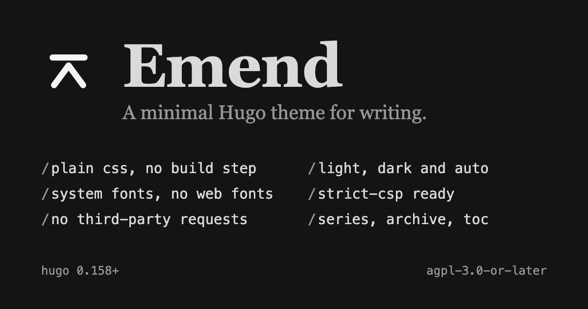

# Emend



A minimal [Hugo](https://gohugo.io) theme for writing: long-form posts and
notes, tags and series, an archive, and very little else.
**[See the live demo](https://haydenk.github.io/emend/).**

- **Plain CSS, no build step.** It builds on standard Hugo. No Sass, PostCSS
  or Node.
- **System fonts.** No web fonts to download.
- **Light, dark and auto.** One button cycles the three, and the choice applies
  before first paint.
- **Strict-CSP ready.** No third-party requests, one inline script allowed by
  hash, and no inline event handlers.
- **Fast by default.** Inlined stylesheet, one small deferred script, and
  images served as sized, lazy-loaded WebP with a `srcset`.
- **Accessible.** Landmarks, a skip link, one `<h1>` per page, visible focus,
  AA contrast in both modes, and reduced-motion support.
- **Extensible without forking.** Hooks, a custom stylesheet, palettes and
  icons, all from the site.

## Quick start

Emend needs Hugo 0.158.0 or later (the standard edition is enough).

```toml
# hugo.toml
[[module.imports]]
path = "github.com/haydenk/emend"

# Hugo does not merge these from a theme, so the site sets them:
[markup.highlight]
noClasses = false

[markup.goldmark.parser]
wrapStandAloneImageWithinParagraph = false
```

Or extract a [release](https://github.com/haydenk/emend/releases) tarball into
`themes/` and set `theme = "emend"`.
[Getting started](docs/getting-started.md) has a complete minimal site.

## Content Security Policy

The theme's one inline script is allowed with:

```
script-src 'self' 'sha256-p0dTuQa+s03teJj7uBSVbGnSrucoYbl82pqs3gwbfBM='
```

`style-src` needs `'unsafe-inline'`. The hash is the same with and without
`hugo --minify`. [Content Security Policy](docs/content-security-policy.md)
has the full policy and a checker you can run on your own site.

## Documentation

| Guide | What it covers |
| --- | --- |
| [Getting started](docs/getting-started.md) | Requirements, install, required configuration, a minimal site |
| [Configuration](docs/configuration.md) | Every parameter, menus, pagination, taxonomies |
| [Writing content](docs/content.md) | Tags and series, archive, images, code, descriptions |
| [Customizing](docs/customizing.md) | Hooks, custom CSS, dark mode, palettes, icons, favicons |
| [Content Security Policy](docs/content-security-policy.md) | The policy, the script hash, the checker |
| [Migrating an existing site](docs/migrating.md) | A checklist for moving a site onto the theme |
| [Development](docs/development.md) | mise tasks, the Dagger pipeline, tests, CI and releases |

## Contributing

Bug reports and pull requests are welcome: see
[CONTRIBUTING.md](CONTRIBUTING.md) and the
[Code of Conduct](CODE_OF_CONDUCT.md). Questions go to
[Discussions](https://github.com/haydenk/emend/discussions), and security
reports to the [Security policy](.github/SECURITY.md). Changes are recorded in
the [changelog](CHANGELOG.md).

## License

[AGPL-3.0-or-later](LICENSE). Emend is a hard fork of
[Typo](https://github.com/tomfran/typo) by Francesco Tomaselli, which is MIT
licensed; that notice, and the credit for the Simple Icons brand icons, are
kept in [NOTICE](NOTICE).
