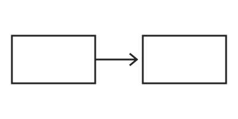

+++
title = "Markdown reference: every content element"
date = 2026-09-01T10:00:00Z
tags = ["markdown", "reference"]
series = "theme-tour"
+++

Intro paragraph with a [link](https://example.org), `inline code`, **bold**, *italic* and ***bold italic***. This page has no description, so the meta description falls back to this summary.

## Images





An inline image  inside a sentence must not become a figure.

[](https://example.org/)


## Deep lists

- Level one item with enough text to wrap on a narrow phone screen for sure
  - Level two item with enough text to wrap on a narrow phone screen
    - Level three item with enough text to wrap on a narrow screen
      - Level four item with enough text to wrap on a narrow screen
        - Level five item with enough text to wrap

1. First
   1. Nested first
      1. Nested nested first
2. Second

- [ ] task open
- [x] task done

### Table

| Column one header | Column two header | Column three header | Column four header | Column five |
| --- | :---: | ---: | --- | --- |
| some cell content here | more cell content here | 12345 | yet more cell content | final cell content |

### Code

```go
func main() { fmt.Println("a very long line of code that will certainly overflow the code block on a phone screen width of 390px") }
```

```python {linenos=inline,hl_lines=[3]}
# Greet someone by name.
def greet(name: str, times: int = 2) -> str:
    message = f"Hello, {name}! " * times
    return message.strip()
```

```js {linenos=table}
// Line numbers in a table: a long line must scroll inside the block, not widen the page.
const message = ["a", "very", "long", "line", "of", "code", "that", "overflows", "a", "phone", "screen"].join(" ");
```

#### A fourth-level heading

> A blockquote with some text.

Footnote here.[^1]

[^1]: The note.
